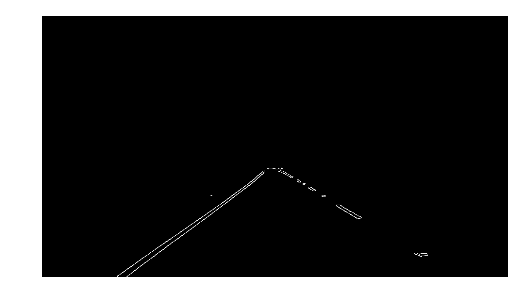
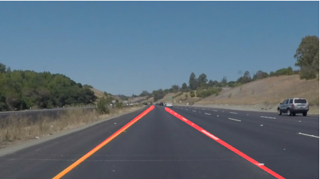

# **Project 1: Finding Lane Lines on the Road**   
### Udacity's Self-Driving Car Nanodegree

### Objective
When we drive, the lines on the road are the visual reference we use to steer vehicles on roads and highways. For a self-driving cars being able to make use of this reference is an important tool to navigate our current road infractructure. The objective of this project was to explore a simple methods to detect lane lines using Computer Vision techniques with Python and a dedicated library called OpenCV (Open-Computer Vision). The algorithm used and the results will be discussed in the sections below.

### Algorithm Overview
A pipeline was developed to process single images and overlay the detected lane lines. This pipeline was then applied to a video stream, which is only a collection of images. The foundation of this algorithm rest on the ability to detect edges on an image, in other words, extract just the outlines of the different contents.

Figure 1: Original Image   | Figure 2: Canny Edge Detection
:-------------------------:|:-------------------------:
 | 

Figure 3: Region of Interest           |  Figure 4: Lane Detected Image
:-------------------------:|:-------------------------:
  |   

In Figure 2 you are able to see edges of the lane markings on the road after applying the Canny filter. In addition, you can also see the edges of the rest of the scene. These edges aren't important. A mask is applied to isolate the region of interest. This is shown in Figure 3. From this filtered image we determine which white pixels are part of the same line by using Hough space. The Hough Transform is applied and sets of endpoints describing lines along the lane are obtained. These are grouped by their slopes into left and right lane lanes, averaged and then extrapolated to extend over the length of the visible lane.

#### Summary of Algorithm to Find Lane Lines on Images:
1. Change image to gray scale
2. Apply Gaussian Blur to reduce image noise
3. Apply Canny Edge Detection
4. Mask the resulting image to only include the region of interest
5. Apply Hough Transform to extract Hough lines
6. Separate lines by slope into left and right lane lines
7. Draw extrapolated lines to extend over the detected lane markings

### Results
The Jupyter Notebook <A HREF="https://github.com/oargueta3/SDCND-Project-1-Finding-Lanes/blob/master/P1-Oscar%20Argueta.ipynb" target="_blank">**`P1-Oscar Argueta.ipynb`**</A> contains the code
to find lane lines and has some example images. It also contains a *Reflection* section where the algorithm robustness is discussed in detail.

#### Video Stream 1 
<a href="https://www.youtube.com/embed/yG2VUFMliJ4 target="_blank"></a>

#### Video Stream 2
<a href="https://www.youtube.com/embed/vOnPsi73Q98" target="_blank"></a>

### Useful References
* Finding Edges(Sobel Operators): https://www.youtube.com/watch?v=uihBwtPIBxM
* Canny Edge Detector:https://www.youtube.com/watch?v=sRFM5IEqR2w
* Gaussian Blur: https://www.youtube.com/watch?v=C_zFhWdM4ic
* Hough Transform: https://www.youtube.com/watch?v=4zHbI-fFIlI

### Enviroment Setup

**Step 1**: Install Anaconda  

Download and install the Anaconda package manager <A HREF="https://www.continuum.io/downloads" target="_blank">here</A>.Create and activate a separate Python 3 environment for this project with the following command:
```sh
$ conda create --name NewEnvironment python=3 
$ source activate NewEnvironment
```

**Step 2:** Install OpenCV  

Once you've installed anaconda AND have activated your new enviroment run the following command:
```sh
$ conda install -c menpo opencv3=3.1.0
```

**Step 3:** Install moviepy   

moviepy is used for processing video. To install run the following command:
```sh
$ pip install moviepy 
```

**Step 4:** Launch Jupyter Notebooks  

This project was made on a Jupyter Notebook. To open the jupyter notebook for this project navigate to directory where the project files are and run the following command: 
```sh
$ jupyter notebook
```


